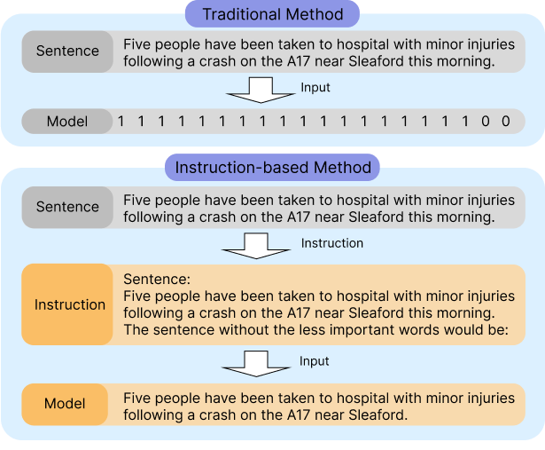

# InstructCMP: Length Control in Sentence Compression through Instruction-based Large Language Models

[](https://aclanthology.org/2024.findings-acl.532/) [](https://aclanthology.org/2024.findings-acl.532/)


**Accepted to ACL 2024 Findings Long**  
**Authors:** Juseon-Do, Jingun Kwon, Hidetaka Kamigaito, Manabu Okumura

[**Read the Paper**](https://aclanthology.org/2024.findings-acl.532/)



## 📚 Overview
This paper presents **InstructCMP**, an instruction-based method for sentence compression that leverages length priming to enforce output length constraints without requiring model modifications.

## 🚀 Getting Started
### 1. Clone the Repository
```
$ git clone https://github.com/JuseonDo/InstructCMP.git
```

### 2. Run
```
$ cd InstructCMP
$ python src/run.py --model_size "13" \
                    --batch_size 10 \
                    --data_name "Google" \
                    --split "test"
```

## 📂 InstructCMP Dataset Structure

Dataset folder has the following structure:
```
InstructCMP
├── dataset folder
│   ├── Google
│   │   ├──google_test.jsonl
│   │   ├──google_valid.jsonl
│   │   └──google_train.jsonl
|   |
│   ├── Broadcast
│   │   └──broadcast_test.jsonl
|   |
│   ├── BNC
│   │   └──bnc_test.jsonl
|   |
│   └── DUC2004
│       └──duc2004_test.jsonl
|
├── src
│   ├── evaluate_utils
│   │   evaluate_functions.py
|   |
│   ├── inference_utils
│   │   └──functions.py
|   |
│   └── utils
|      └──templates.py
|
└── run.py
```


# 🔍 Evaluation
The metrics used in this work are in [evaluation_metrics](https://github.com/JuseonDo/InstructCMP/evaluation).

```python
post_processed_outputs = generated_output_post_processing(generated_text)
result = evaluate(targets, sources, post_processed_outputs)
```

# 📄 Citation
@inproceedings{juseon-do-etal-2024-instructcmp,
    title = "{I}nstruct{CMP}: Length Control in Sentence Compression through Instruction-based Large Language Models",
    author = "Juseon-Do  and
      Kwon, Jingun  and
      Kamigaito, Hidetaka  and
      Okumura, Manabu",
    editor = "Ku, Lun-Wei  and
      Martins, Andre  and
      Srikumar, Vivek",
    booktitle = "Findings of the Association for Computational Linguistics: ACL 2024",
    month = aug,
    year = "2024",
    address = "Bangkok, Thailand",
    publisher = "Association for Computational Linguistics",
    url = "https://aclanthology.org/2024.findings-acl.532/",
    doi = "10.18653/v1/2024.findings-acl.532",
    pages = "8980--8996",
}

# ✉️ Contact
If you have any questions about this work, please contact **Juseon-Do** using the following email addresses: **dojuseon@gmail.com** or **doju00@naver.com**. 

